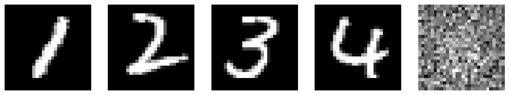
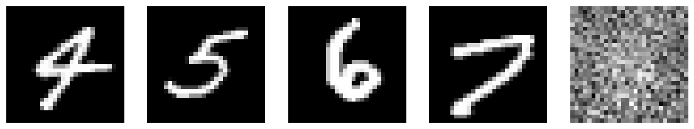
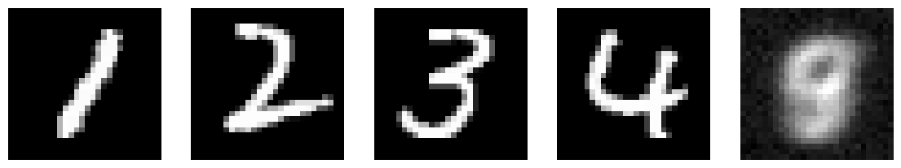
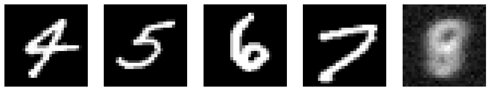
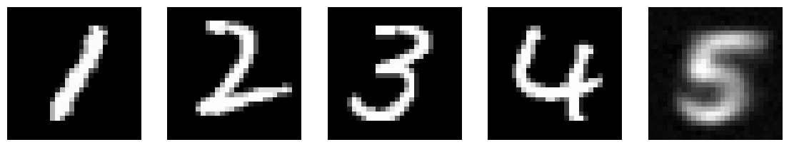
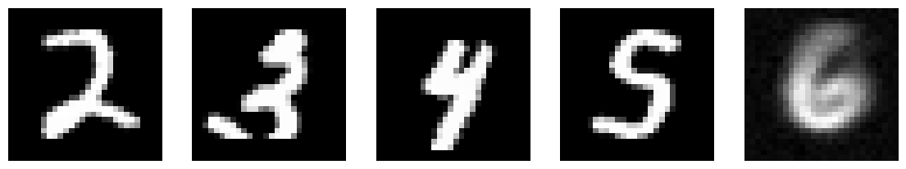
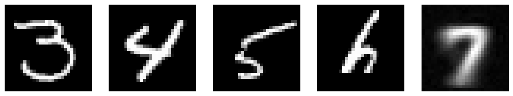
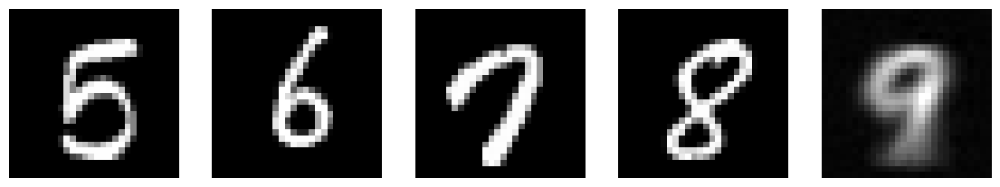

# Next-Img-Prediction-ImgGeneration-LSTM

A simple image generation based on next image prediction with LSTM - MNIST

## Model Architecture

```python
class Model(Sequential):
    def __init__(self, optimizer, X_train, y_train, iters):
        super().__init__()

        self.add(LSTM(128, activation='relu', input_shape=(4, 28*28), return_sequences=True))
        self.add(LSTM(64, activation='relu'))
        self.add(Dense((28*28), activation='linear'))
        self.add(Reshape((28, 28)))

        self.compile(
            optimizer=optimizer, loss='mean_squared_error', metrics=['mse']
        )
        self.fit(X_train, y_train, epochs=iters)
```

Models output with different optimizers:

```python
model = Model(optimizer='adam', X_train=X_train, y_train=y_train, iters=2)
```








```python
model = generator_model('rmsprop')
```








```python
model = generator_model('adam')
```










