# Next-Img-Prediction-ImgGeneration-LSTM

A deep learning project that generates images based on next image prediction using LSTM networks. This project specifically works with the MNIST dataset to predict the next image in a sequence.

## Project Overview

This project implements an LSTM-based neural network model to predict and generate sequential images from the MNIST dataset. The code has been organized into modular components for improved maintainability and reusability.

## How It Works

The system works by:

1. **Data Preparation**: MNIST images are arranged into sequences of 4 consecutive digits.
2. **Input Processing**: Each image is flattened from 28x28 pixels to a 784-dimensional vector.
3. **Sequence Learning**: The LSTM network learns patterns from these sequences.
4. **Prediction**: Given a sequence of images, the model predicts what the next image should be.
5. **Generation**: By feeding predictions back into the model, we can generate new images in a chain.

For example, if the model is shown images of digits [5,6,7,8], it should predict an image of digit 9. By iteratively using its own outputs as inputs, the model can generate sequences of related digits.

**Input**
- The input data is a list of images, each image is a 2D array of shape (28, 28).
- The output data is a image.
- All images are in a mathematical format.
- Each image is one larger than the previous one and one smaller than the next.

| Inputs         | Output |
|:--------------:|:------:|
| 0 - 1 - 2 - 3  |   4    |
| 1 - 2 - 3 - 4  |   5    |
| 2 - 3 - 4 - 5  |   6    |
| 3 - 4 - 5 - 6  |   7    |
| 4 - 5 - 6 - 7  |   8    |
| 5 - 6 - 7 - 8  |   9    |

Examples: 
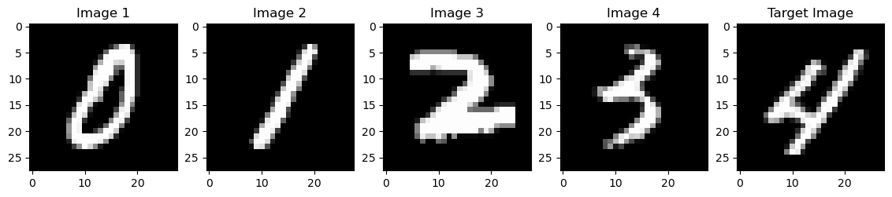
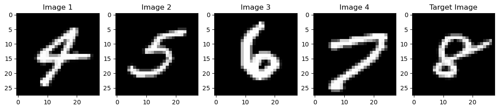

## Project Structure

The project has been refactored into modular components:

- `data.py`: Data loading and preparation
- `preprocessing.py`: Data preprocessing and sequence generation
- `model.py`: LSTM model implementation
- `main.ipynb`: Main training and evaluation workflow

## Model Architecture

The `NextImagePredictor` class extends Keras' Sequential model to create a specialized LSTM network for image sequence prediction

## Results with Different Optimizers

The model was trained with different optimizers to compare performance. Below are the results obtained with each optimizer.

### SGD (Stochastic Gradient Descent) Optimizer Results
The following images were generated using the SGD optimizer:

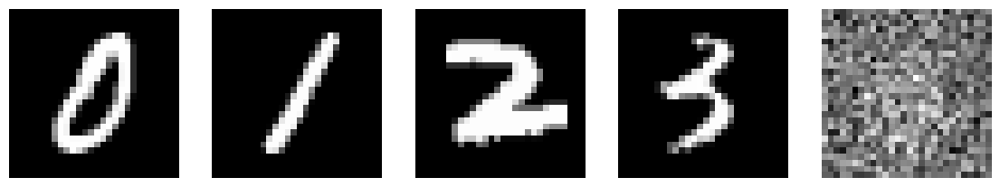
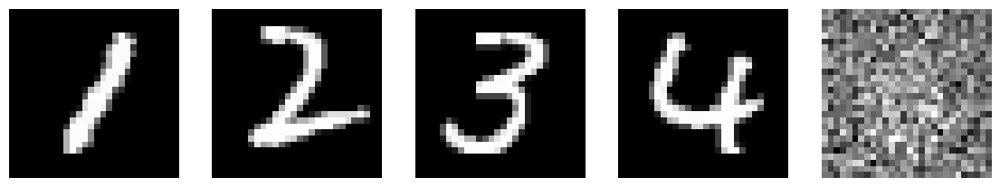
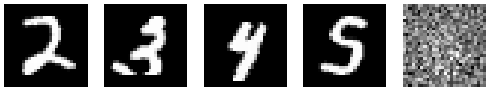
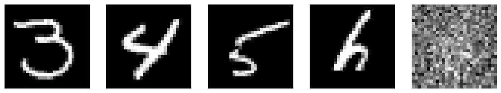
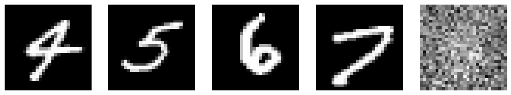
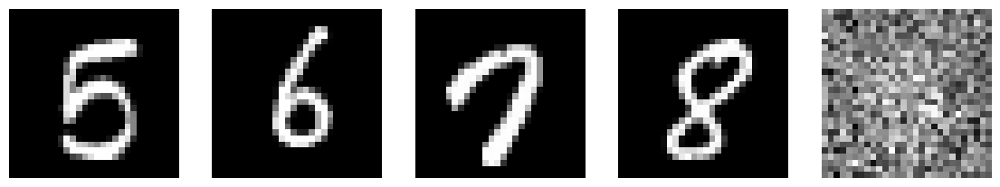

### RMSprop Optimizer Results
The following images were generated using the RMSprop optimizer:

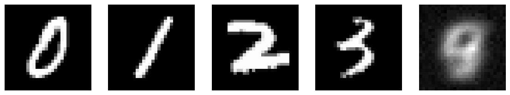
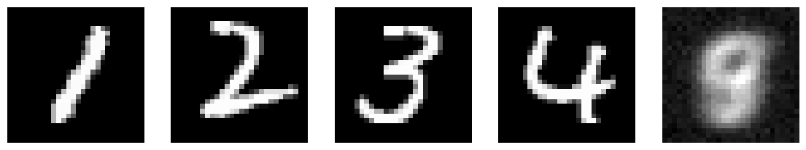
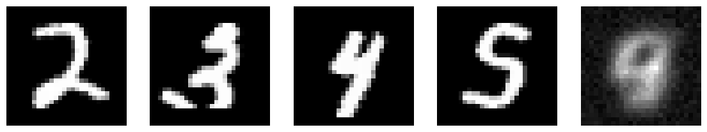
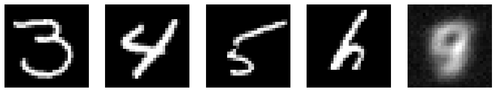
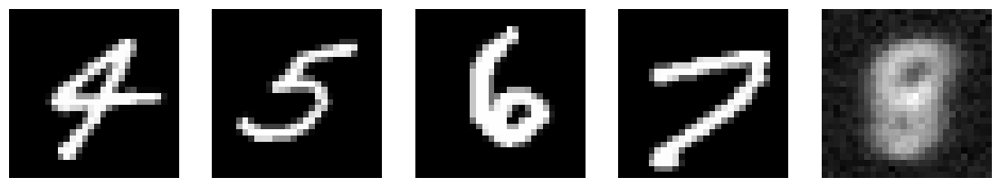
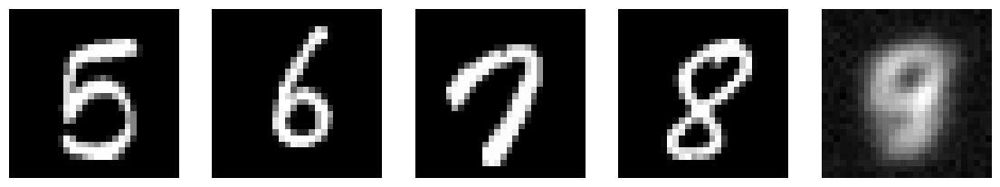

### Adam Optimizer Results
The following images were generated using the Adam optimizer:

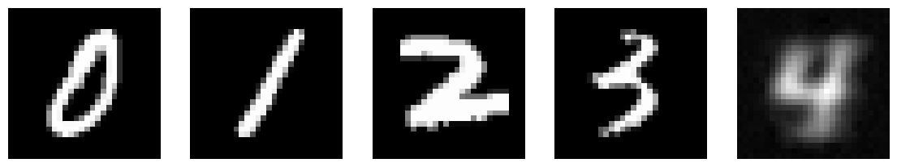
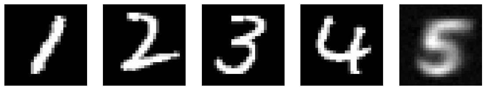
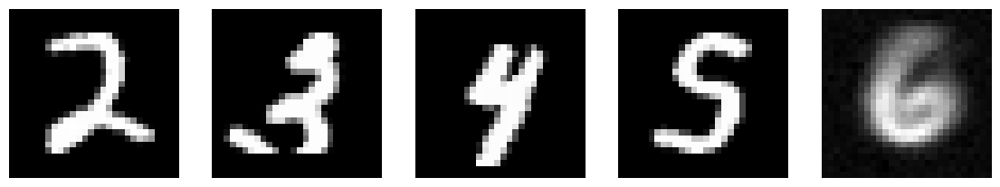
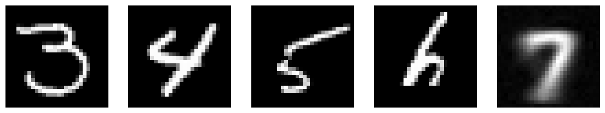

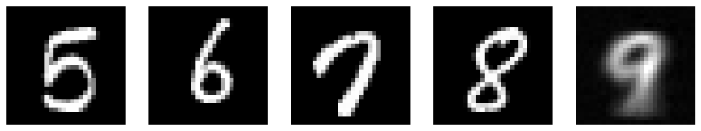